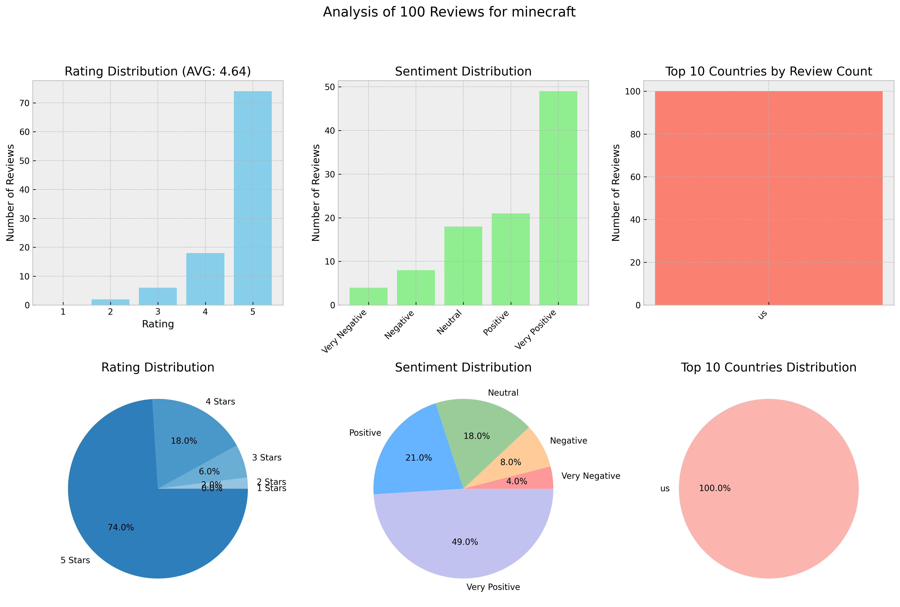

# App Reviews Analyzer

FastAPI-based service that fetches, analyzes and provides insights from mobile app reviews across the App Store and Google Play Market. The service uses advanced machine learning for sentiment analysis and LLM-powered review summarization.

## Features

- **Data Sources**
  - App Store
  - Google Play Market

- **Advanced Analytics**
  - Sentiment analysis using `tabularisai/multilingual-sentiment-analysis` model. This model is a fine-tuned version of `distilbert/distilbert-base-multilingual-cased` for multilingual sentiment analysis. Number of Classes: 5 (Very Negative, Negative, Neutral, Positive, Very Positive)
  - Rating, Geographical and Sentiment distribution of reviews.
  - Comprehensive AI-generated summary powered by Anthropic's Claude that analyzes key themes, identifies critical issues, provides actionable suggestions and evaluates overall sentiment across batches of reviews.

- **Rich Visualization**
  - Rating distribution visualization
  - Sentiment distribution visualization
  - Geographical distribution visualization

- **API Features**
  - RESTful API endpoints
  - Flexible response format
  - Customizable number of reviews (1-1000)

## Technologies

- **Backend Framework**: FastAPI
- **Python Version**: 3.11
- **Key Libraries**:
  - `app-store-scraper` & `google-play-scraper` for data collection
  - `langchain` & `langchain-anthropic` for LLM integration
  - `transformers` for sentiment analysis
  - `matplotlib` for data visualization
  - `uvicorn` for ASGI server

## Setup and Installation

### Prerequisites

- Python 3.11
- Docker (optional)

### Environment Setup

1. Clone the repository:
```bash
git clone <repository-url>
cd App-Reviews-Analyzer
```

2. Create and configure environment variables:
```bash
cp .env.example .env
```

Edit `.env` file with your credentials:
- Add your Anthropic API key
- Configure LLM settings
- Set up LangSmith tracking (optional)

### Running Locally

1. Install dependencies using `uv`:
```bash
pip install uv
uv sync
```

2. Start the server:
```bash
uvicorn app:app --host 0.0.0.0 --port 8000
```

### Running with Docker

1. Build the Docker image:
```bash
docker build -t app-reviews .
```

2. Run the container:
```bash
docker run -p 8000:8000 -d app-reviews
```

## API Usage

### Get App Reviews Analysis

Visit the Swagger UI documentation at `http://localhost:8000/docs` to explore and test the API endpoints interactively.

Parameters:
- `app_name`: Name of the app
- `app_id`: App ID (numeric for App Store, package name for Google Play)
- `reviews_source`: Either "app_store" or "google_play_market"
- `num_reviews`: Number of reviews to analyze (1-1000)
- `country`: Country code (default: "us")
- `include_llm_summary`: Include AI-generated summary (default: true)
- `include_metrics`: Include statistical metrics (default: true)
- `include_plots`: Include visualization plots (default: true)
- `include_raw_data`: Include raw review data (default: true)

## Response Schema

```json
{
  "llm_summary": "Summary of reviews...",
  "metrics": {
    "total_reviews": 100,
    "average_rating": 4.5,
    "sentiment_distribution": {...},
    "rating_distribution": {...},
    "country_distribution": {...}
  },
  "plots": {
    "image": "base64_encoded_image",
    "format": "png",
    "encoding": "base64"
  },
  "raw_data": {
    "reviews": [...]
  }
}
```

## Examples

## APP 1

*Summary:*
```summary```

## APP 2

*Summary:*
```summary```

## APP 3

*Summary:*
```summary```

