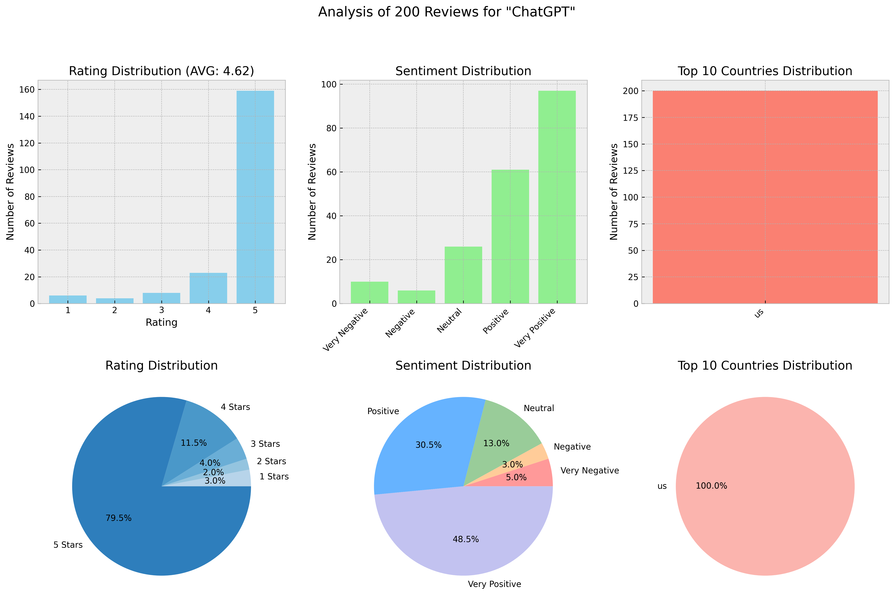
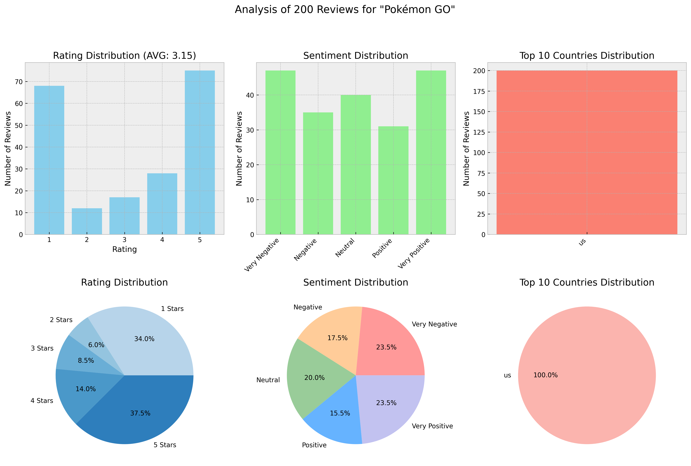
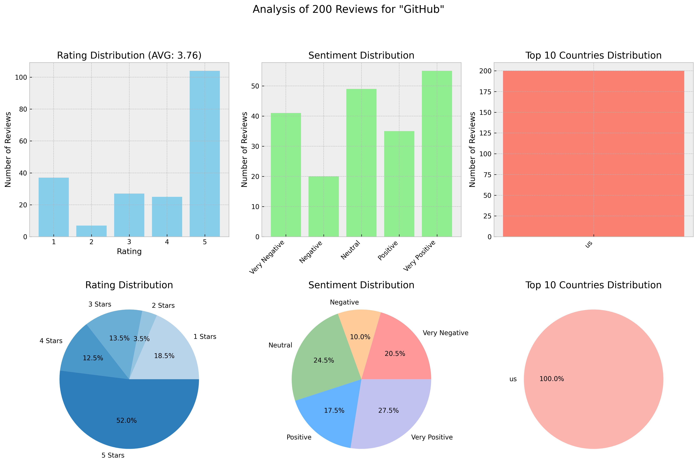

# App Reviews Analyzer

FastAPI-based service that fetches, analyzes and provides insights from mobile app reviews across the App Store and Google Play Market. The service uses advanced machine learning for sentiment analysis and LLM-powered review summarization.

## Features

- **Data Sources**
  - Google Play Market (recommended)
  - App Store

- **Advanced Analytics**
  - **Statistical Processing**: Comprehensive analysis of rating distributions, geographical patterns, and sentiment trends across review data.
  - **Rich Analytics**: Visualization of key metrics and statistical insights.
  - **Sentiment Analysis**: Powered by `tabularisai/multilingual-sentiment-analysis` model, a fine-tuned version of `distilbert/distilbert-base-multilingual-cased`. Supports multilingual review classification across 5 sentiment categories (Very Negative to Very Positive).
  - **AI-Powered Insights**: Leverages Anthropic's Claude to process reviews, generating detailed summaries that highlight key themes, critical issues and actionable product recommendations.

- **API Features**
  - RESTful API endpoints
  - Flexible response format

## Technologies

- **Backend Framework**: FastAPI
- **Python Version**: 3.11
- **Key Libraries**:
  - `app-store-scraper` & `google-play-scraper` for data collection
  - `langchain` & `langchain-anthropic` for LLM integration
  - `transformers` for sentiment analysis
  - `matplotlib` for data visualization
  - `uvicorn` for ASGI server

## Setup and Installation

### Prerequisites

- Python 3.11
- Docker (optional)

### Environment Setup

1. Clone the repository:```bash
git clone <repository-url>
cd App-Reviews-Analyzer
```

2. Create and configure environment variables:
```bash
cp .env.example .env
```

Edit `.env` file with your credentials:
- Add your Anthropic API key
- Configure LLM settings
- Set up LangSmith tracking (optional)

### Running with Docker (Recommended)

1. Build the Docker image:
```bash
docker build -t app-reviews .
```

2. Run the container:
```bash
docker run -p 8000:8000 -d app-reviews
```

### Running Locally

1. Install dependencies using `uv`:
```bash
pip install uv
uv sync
```

2. Start the server:
```bash
uvicorn app:app --host 0.0.0.0 --port 8000
```

## API Usage

### Get App Reviews Analysis

Visit the Swagger UI documentation at `http://localhost:8000/docs` to explore and test the API endpoints interactively.

Parameters:
- `app_name`: Name of the app
- `app_id`: App ID (numeric for App Store, package name for Google Play)
- `reviews_source`: Either "app_store" or "google_play_market"
- `num_reviews`: Number of reviews to analyze (1-1000)
- `country`: Country code (default: "us")
- `include_llm_summary`: Include AI-generated summary (default: true)
- `include_metrics`: Include statistical metrics (default: true)
- `include_plots`: Include visualization plots (default: true)
- `include_raw_data`: Include raw review data (default: true)

## Response Schema

```json
{
  "llm_summary": "Summary of reviews...",
  "metrics": {
    "total_reviews": 100,
    "average_rating": 4.5,
    "sentiment_distribution": {...},
    "rating_distribution": {...},
    "country_distribution": {...}
  },
  "plots": {
    "image": "base64_encoded_image",
    "format": "png",
    "encoding": "base64"
  },
  "raw_data": {
    "reviews": [...]
  }
}
```

## Examples

## ChatGPT

```
**Overview**:
ChatGPT's mobile app maintains its strong market position with an overwhelmingly positive user reception, evidenced by predominantly 5-star ratings. The application continues to excel as a versatile AI assistant, particularly valued for its educational support, personal assistance capabilities, and comprehensive knowledge base. Users consistently praise its ability to provide detailed, helpful responses across various use cases, though some technical limitations and feature restrictions remain areas for improvement. The app has established itself as an essential tool for many users, with many highlighting its role as both an educational companion and personal assistant.

**Major Themes**:
1. Educational Support
- Widespread use for exam preparation and homework help
- Detailed explanations and learning assistance
- Strong adoption among students

2. Personal Connection
- Users developing emotional bonds with the AI
- Friendly, conversational interactions
- Personalized assistance across various needs

3. User Experience
- Generally positive interface feedback
- Some concerns about conversation retention
- Processing speed variations noted

4. Versatility
- Multi-purpose functionality
- Cross-domain knowledge application
- Adaptability to different user needs

**Strengths**:
1. Educational Excellence
- Comprehensive subject knowledge
- Detailed explanations for students
- Exam preparation support
- Quick problem-solving capabilities

2. User Engagement
- Strong emotional connection with users
- Friendly, conversational interface
- Personalized interaction style
- Ability to form rapport with users

3. Versatility
- Wide-ranging knowledge base
- Adaptability to various queries
- Multiple use case applications
- Consistent performance across tasks

4. Response Quality
- Detailed and informative answers
- Quick response times for most queries
- Helpful guidance across topics

**Pain Points**:
1. Technical Issues
- Loss of chat history when closing the app
- Limited access to past conversations
- Processing speed concerns for some users

2. Feature Limitations
- Restrictions on image-related features
- Voice functionality constraints
- Limited free tier capabilities

3. Content Accuracy
- Occasional pricing information inaccuracies
- Some date and time orientation issues
- Varying response quality in specific cases

**Recommendations**:
1. Immediate Actions
- Implement chat history preservation
- Improve processing speed optimization
- Enhance conversation retention capabilities

2. Short-term Improvements
- Expand image processing capabilities
- Enhance voice feature accessibility
- Implement better data accuracy checks

3. Long-term Enhancements
- Develop more robust conversation management
- Improve response speed and consistency
- Expand free tier features

4. Feature Additions
- Add user feedback mechanism within app
- Implement conversation backup system
- Enhance multimedia interaction capabilities
```

## Pokémon GO

```
Pokémon GO continues to maintain a divided user base, with significant shifts in user sentiment primarily driven by recent technical issues and monetization changes. The game faces mounting criticism over its increasingly aggressive monetization strategy while still retaining loyal players who appreciate its core features and social aspects. Technical stability has become a major concern following recent updates, with many users reporting critical issues preventing basic gameplay. The overall user experience shows a clear divide between paying and non-paying players, with accessibility and value proposition becoming increasingly contentious issues.

**Major Themes:**
1. Technical Stability
- Widespread crashing issues after recent update
- Login and loading problems
- Device compatibility issues, particularly with newer phones
- Performance degradation and lag

2. Monetization Concerns
- Increasing shift toward "pay-to-play" model
- Rising prices for items and event tickets
- Limited free-to-play progression
- Special event and feature paywalls

3. Player Experience
- Strong social and outdoor activity elements
- Accessibility issues for various player groups
- Regular content updates and events
- Battle system problems

4. Game Balance
- Rural vs. urban player disparities
- Catch rate difficulties
- Shiny Pokémon rarity concerns
- PvP system issues

**Strengths:**
1. Core Gaming Experience
- Engaging collection mechanics
- Regular events and updates
- Strong social interaction features
- Motivation for physical activity

2. Community Features
- Multiplayer raid battles
- Friend system functionality
- Social gameplay elements
- Cross-generational appeal

3. Content Updates
- Regular new Pokémon additions
- Special events and tours
- Seasonal content
- Battle League opportunities

**Pain Points:**
1. Critical Technical Issues
- Game crashes after recent update
- Loading and authentication problems
- Device compatibility concerns
- Performance issues

2. Monetization Problems
- Aggressive monetization strategy
- Expensive event tickets ($19+)
- Limited free-to-play progression
- Increasing prices for items

3. Accessibility Issues
- Rural player disadvantages
- Mobility-restricted player limitations
- Geographic restrictions
- Weather system problems

4. Gameplay Frustrations
- PvP battle bugs and exploits
- Account security concerns
- Catch rate difficulties
- Connection issues

**Recommendations:**
Immediate Actions:
1. Technical Stability
- Address critical crash issues from recent update
- Improve device compatibility
- Fix authentication problems
- Resolve loading issues

2. Monetization Balance
- Review pricing structure
- Introduce more free-to-play progression paths
- Improve value proposition of paid features
- Add alternative coin earning methods

3. Quality of Life
- Enhance rural player experience
- Improve accessibility options
- Address PvP stability issues
- Fix weather system bugs

Long-term Improvements:
1. Player Experience
- Develop better free-to-play progression
- Create more inclusive gameplay options
- Balance urban/rural gameplay
- Enhance account security

2. Game Systems
- Revise monetization strategy
- Improve catch rate mechanics
- Enhance PvP battle system
- Develop alternative progression paths

3. Technical Infrastructure
- Optimize performance across devices
- Strengthen server stability
- Improve location services
- Enhanced testing procedures
```

## GitHub

```
**Overview**:
GitHub's mobile app maintains its position as a useful companion tool for developers, with mixed user satisfaction levels. The app successfully serves basic GitHub functions while continuing to face challenges with authentication and feature completeness. User sentiment remains divided, with strong appreciation for mobile convenience and basic functionality, but persistent frustration over authentication issues and limited feature set compared to the web version. Recent feedback highlights improved development capabilities and Copilot integration, though core challenges persist.

**Major Themes**:
1. Authentication and Access
- Persistent login difficulties
- Two-factor authentication challenges
- Account suspension issues
- Browser-app authentication conflicts

2. Feature Coverage
- Limited functionality compared to web version
- Missing repository creation capabilities
- Restricted project layout options
- Positive reception of new development features

3. User Experience
- Generally positive UI/UX feedback
- Effective for mobile code review
- Clunky navigation in some areas
- Good performance for basic tasks

4. Development Capabilities
- Improved coding functionality
- Copilot integration appreciation
- Limited repository management options
- Mobile development possibilities

**Strengths**:
1. Basic Functionality
- Effective for quick code reviews
- Reliable notification management
- Good mobile access to repositories
- Stable core features

2. Development Features
- Copilot integration
- Basic coding capabilities
- Improved development tools
- Mobile coding possibilities

3. User Interface
- Clean, professional design
- Good mobile optimization
- Positive UX for basic tasks
- Regular improvements

4. Convenience
- Effective for on-the-go access
- Quick PR reviews
- Easy notification handling
- Basic repository browsing

**Pain Points**:
1. Authentication Issues
- Persistent login problems
- 2FA complications
- Account suspension concerns
- Conflicts with browser authentication

2. Feature Limitations
- Cannot create repositories
- Limited project layout support
- Missing label management
- Restricted issue management

3. Development Constraints
- Limited compared to web version
- Basic repository management
- Restricted file handling
- Missing advanced features

4. User Experience Challenges
- Navigation complexity
- Browser-app conflicts
- Registration confusion
- Limited customization options

**Recommendations**:
Immediate Actions:
1. Authentication Enhancement
- Resolve login reliability issues
- Improve 2FA implementation
- Fix browser-app authentication conflicts
- Streamline account verification

2. Critical Feature Implementation
- Add repository creation capability
- Implement label management
- Expand project layout support
- Improve issue management tools

3. User Experience Improvements
- Simplify navigation structure
- Add clear registration process
- Enhance file management interface
- Improve authentication flow

Long-term Improvements:
1. Feature Development
- Expand repository management capabilities
- Add advanced project management tools
- Implement full issue-to-discussion conversion
- Enhance mobile development features

2. Platform Integration
- Better web-mobile synchronization
- Improved browser compatibility
- Enhanced desktop-mobile workflow
- Expanded Copilot integration

3. Development Tools
- Advanced coding capabilities
- Expanded file handling
- Better project management tools
- Enhanced collaboration features
```
